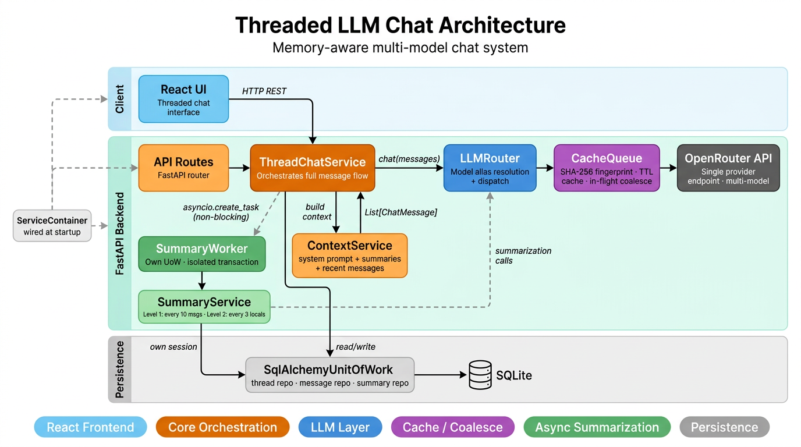
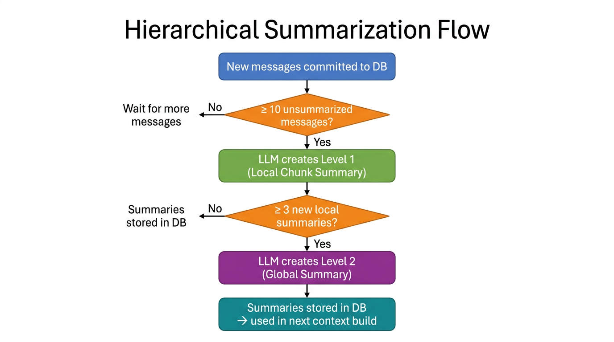
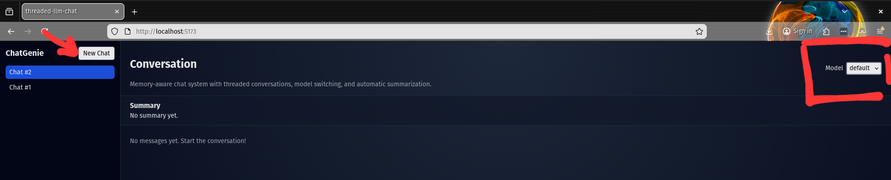
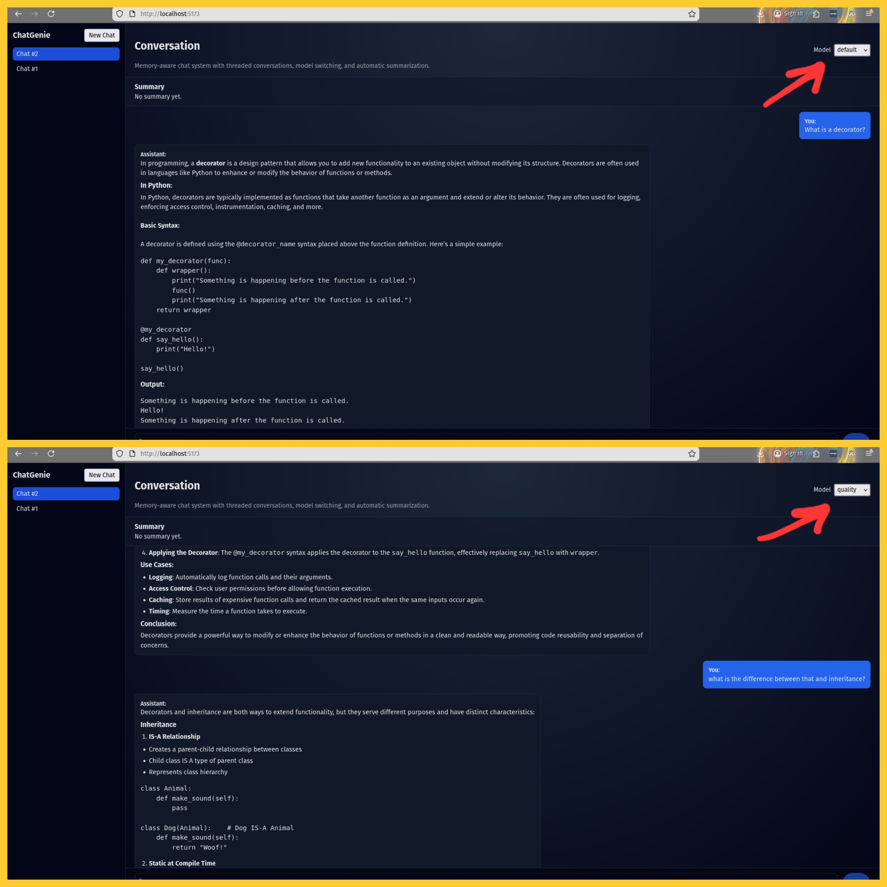
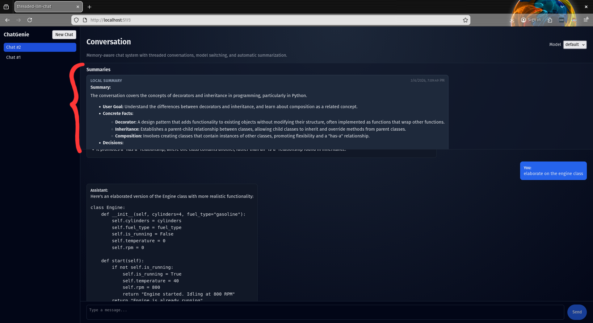

<style>
section {
  font-size: 20px;
  line-height: 1.4;
}
h1 {
  font-size: 32px;
  margin-bottom: 12px;
}
h2 {
  font-size: 26px;
  margin-bottom: 8px;
}
table {
  font-size: 18px;
}
pre, code {
  font-size: 16px;
}
img {
  max-height: 420px;
  object-fit: contain;
}
section.dense {
  font-size: 17px;
  line-height: 1.3;
}
section.dense table {
  font-size: 15px;
}
section.dense pre, section.dense code {
  font-size: 14px;
}
</style>

# Threaded LLM Chat System

**Full Stack Threaded LLM Chat System with Memory**

`threaded-llm-chat`

Backend: FastAPI + SQLAlchemy (SQLite) + OpenRouter  
Frontend: React + Vite

---

# What Was Built

- **Thread management** with persistent history and a per-thread constant system prompt
- **N-model LLM integration** via OpenRouter — config-driven model aliases with per-request switching
- **Bounded context assembly:** system prompt → global summary → recent local summaries → recent messages
- **Hierarchical two-level auto-summarization** (local every 10 messages, global every 3 locals)
- **Clean service boundaries:** `ThreadChatService`, `ContextService`, `LLMRouter`, `SummaryService`
- **LLMOps extension:** in-memory TTL cache + in-flight request coalescing via `CacheQueue`
- **React frontend** with thread sidebar, model switcher, and live summary panel
- **21 tests:** health, full thread flow E2E, and swappability boundary tests

---

# 1. Architecture Diagram



---

<!-- _class: dense -->

# Architecture Layers

| Layer | Responsibility | Key Modules |
|-------|---------------|-------------|
| **Client** | Threaded chat UI, model selection | `App.tsx`, `chatStore.ts`, `httpChatApi.ts` |
| **API** | HTTP endpoints, validation | `app/api/routes/threads.py`, `health.py` |
| **Orchestration** | Message flow, context, persistence | `ThreadChatService`, `ContextService` |
| **LLM** | Model resolution, provider dispatch | `LLMRouter`, `ModelCatalog`, `RoutingPolicy` |
| **Cache** | TTL cache, request coalescing | `InMemoryCacheQueue`, `RequestFingerprint` |
| **Summarization** | Background hierarchical summaries | `SummaryWorker`, `SummaryService` |
| **Persistence** | ORM, repositories, unit of work | `SqlAlchemyUnitOfWork`, `Thread`/`Message`/`Summary` models |

---

<!-- _class: dense -->

# Message Flow: Client → Service → LLMs

1. **Client** → `POST /threads/{id}/messages` with content, sender, optional model alias
2. **API Routes** → `ThreadChatService.post_message()`
3. **ThreadChatService** → persists user message → `ContextService.build_context()`
4. **ContextService** → assembles: system prompt → global summary → local summaries → recent messages
5. **LLMRouter** → resolves alias via `RoutingPolicy` → `ModelCatalog` → dispatches through `CacheQueue`
6. **OpenRouterProvider** → calls OpenRouter API → returns `LLMResponse`
7. **ThreadChatService** → persists assistant message → commits → `asyncio.create_task(run_summary_job)`
8. **SummaryWorker** → `SummaryService.maybe_summarize()` in its own UoW

> Summarization never blocks the response path.

---

<!-- _class: dense -->

# Key Design Decisions

| Decision | Why |
|----------|-----|
| `LLMProvider` as a Python `Protocol` | Zero coupling — any class with `name` + `async chat()` is valid |
| `ModelCatalog` / `RoutingPolicy` separated | Alias data and selection logic evolve independently |
| `ServiceContainer` wired once at startup | No service locator in handlers; fully assembled collaborators |
| Summary worker has its own `UoW` | Summarization failure can't roll back a committed chat turn |
| `asyncio.create_task` for summaries | Summary latency is off the critical response path |
| `CacheQueueBackend` Protocol | Swap in-memory → Redis by changing one line |
| Config-driven `MODELS` env var | Add/remove models without code changes |

---

# 2. LLM Orchestration

## N-Model Integration via OpenRouter

Models are configured entirely through the `MODELS` environment variable — a JSON map of user-defined aliases to `provider/model` strings. There is no hard-coded model list; add, remove, or rename models by editing the env var alone.

```json
{
  "primary":   "openrouter/openai/gpt-4o-mini",
  "quality":   "openrouter/anthropic/claude-3.5-sonnet",
  "reasoning": "openrouter/openai/o3-mini"
}
```

`ModelCatalog` parses this at startup → `resolve(alias) → ModelSpec(provider, model)`.
An optional `"summarization"` alias is hidden from the user-facing model list and used internally for summary generation.

---

# Model Routing

`RoutingPolicy` implements a three-tier fallback for every LLM call:

```
1. Per-message model  →  MessageCreate.model (e.g. "quality")
2. Thread default     →  Thread.current_model (set at creation)
3. System default     →  DEFAULT_CHAT_MODEL_ALIAS (env var)
```

```python
# app/integration/model_registry.py — RoutingPolicy
def resolve_chat_model_key(self, requested_model_key, thread_default_model_key):
    return requested_model_key or thread_default_model_key or self._default_model_key
```

A user can switch models mid-conversation per message. The thread continues seamlessly — context and system prompt are shared.

---

# Provider Abstraction

The `LLMProvider` protocol (`app/integration/llm_provider.py`) defines a minimal contract — just `name: str` and `async chat()`. `OpenRouterProvider` is the current implementation.

Adding a new provider (e.g. Ollama, direct OpenAI) is low-risk: implement the protocol, register it in `build_container`, and update the `MODELS` env var. No changes to routing, context, or summarization logic — the new provider is automatically available to both chat and summarization paths.

---

# System Prompt + Context Handling

Each thread stores a `system_prompt` set at creation time. It persists across model switches and is always the first message in the context window.

`ContextService.build_context()` assembles the prompt from four layers:

| # | Source | Role | Purpose |
|---|--------|------|---------|
| 1 | `thread.system_prompt` | `system` | Persistent behavioral instructions |
| 2 | Latest global summary (level 2) | `system` | High-level conversation memory |
| 3 | Last 2 local summaries (level 1) | `system` | Recent chunk-level context |
| 4 | Last 20 raw messages | `user`/`assistant` | Verbatim recent exchange |

This keeps the context window bounded while preserving long-term memory.

---

# Thread Data Model

```
Thread
├── id, title, system_prompt, current_model
├── created_at, updated_at
├── messages[]
│   └── id, role, sender, content, model_id, created_at
└── summaries[]
    └── id, level (1=local, 2=global), summary_text,
        covers_up_to_message_id, created_at
```

- Each `Message` records which `model_id` generated it → full auditability across model switches
- Each `Summary` tracks `covers_up_to_message_id` → the system knows exactly which messages are compressed

---

# 3. Auto-Summarization Logic

## Hierarchical Two-Tier Summarization

Implemented in `SummaryService` (`app/domain/services/summary_service.py`):



---

# Summarization Details

**Level 1 — Local (chunk) summaries:**

- **Trigger:** Every 10 new messages since the last local summary
- **Prompt:** _"Summarize the following segment. Focus on facts, decisions, goals, and open questions."_
- **Output:** Concise paragraph stored with `level=1` and `covers_up_to_message_id`

**Level 2 — Global summaries:**

- **Trigger:** Every 3 new local summaries since the last global summary
- **Input:** Previous global summary (if any) + new local summaries
- **Prompt:** _"Produce an updated high-level summary of the entire conversation."_
- **Output:** Rolling summary stored with `level=2`

**Background execution:** Summarization fires via `asyncio.create_task` after each response.
`SummaryWorker` creates its own `SqlAlchemyUnitOfWork` — failure never affects the chat path.

---

# How Summarization Fits Context Management

Without summarization, a 100-message thread injects all 100 messages into the prompt.

**With summarization (50-message example):**

| Messages | Stored in DB | In context window? |
|----------|-------------|-------------------|
| 1–10 | Local summary 1 | No — absorbed into global |
| 11–20 | Local summary 2 | Yes (1 of last 2 locals) |
| 21–30 | Local summary 3 | Yes (2 of last 2 locals) |
| 3 locals → | Global summary 1 | Yes (latest global) |
| 31–50 | 20 raw messages | Yes (last 20 messages) |

**Result:** 3 summary paragraphs (1 global + 2 recent locals) + 20 raw messages — instead of all 50.
`ContextService` caps locals at 2 and messages at 20, so context stays bounded as threads grow arbitrarily long.

---

<!-- _class: dense -->

# API Endpoints

| Method | Path | Description | Status |
|--------|------|-------------|--------|
| `POST` | `/threads` | Create thread with system prompt | `201` |
| `GET` | `/threads` | List threads (`offset`, `limit`) | `200` |
| `GET` | `/threads/{id}` | Retrieve a thread | `200` |
| `POST` | `/threads/{id}/messages` | Send message, get LLM reply | `201` |
| `GET` | `/threads/{id}/messages` | List messages (`limit`, `since_id`) | `200` |
| `GET` | `/threads/{id}/summaries` | List summaries (local + global) | `200` |
| `POST` | `/threads/{id}/summaries/refresh` | Trigger re-summarization | `202` |
| `GET` | `/health/` | Health check | `200` |
| `GET` | `/health/openrouter` | Verify OpenRouter API key | `200` |
| `GET` | `/health/models` | List available model aliases | `200` |

Swagger UI at `http://localhost:8000/docs`.

---

<!-- _class: dense -->

# API Examples

**Create a thread:**
```bash
curl -X POST http://localhost:8000/threads \
  -H "Content-Type: application/json" \
  -d '{"system_prompt": "You are a helpful assistant.", "title": "Python help"}'
```

**Send a message (model = primary):**
```bash
curl -X POST http://localhost:8000/threads/1/messages \
  -H "Content-Type: application/json" \
  -d '{"content": "What is a decorator?", "sender": "user", "model": "primary"}'
```

**Switch model mid-conversation (model = quality):**
```bash
curl -X POST http://localhost:8000/threads/1/messages \
  -H "Content-Type: application/json" \
  -d '{"content": "Explain it differently", "sender": "user", "model": "quality"}'
```

---

<!-- _class: dense -->

# API Response Examples

**POST /threads/1/messages** — response (201):

```json
{
  "user_message": {
    "id": 5, "thread_id": 1, "role": "user",
    "sender": "user", "content": "What is a decorator?",
    "model_id": null, "created_at": "2026-03-06T12:01:00Z"
  },
  "assistant_message": {
    "id": 6, "thread_id": 1, "role": "assistant",
    "sender": "agent",
    "content": "A decorator is a function that wraps another function...",
    "model_id": "openai/gpt-4o-mini",
    "created_at": "2026-03-06T12:01:01Z"
  },
  "model_used": "openai/gpt-4o-mini"
}
```

`model_id` on the assistant message records which LLM produced it. User messages have `model_id: null`.

---

# 4. Demo Screenshots / Results

## Screenshot 1: Thread Creation

<!-- Save as docs/screenshots/01-thread-creation.png -->



_"New Chat" flow — system prompt, optional title; thread created and visible in sidebar._

---

# Screenshot 2: Model Switch Mid-Thread

<!-- Save as docs/screenshots/02-model-switch.png -->



_Model dropdown showing default/primary/quality, with a message sent using the alternate model in an existing thread._

---

# Screenshot 3: Summary Display

<!-- Save as docs/screenshots/03-summaries.png -->



_Summary panel showing local (Level 1) and global (Level 2) summaries for a long thread._


---

# Sample Summary Output

**Level 1 (local) — after 10 messages:**

```
"User asked about Python decorators and their use cases. Assistant explained
that decorators wrap functions to extend behavior. User then asked about
async/await patterns. Both GPT-4o-mini and Claude-3.5-Sonnet were used."
```

**Level 2 (global) — after 3 local summaries:**

```
"Conversation covers Python fundamentals: decorators, async/await, and type
hints. User is building a web service and prefers concise, example-driven
explanations. Two models were used interchangeably."
```

Summaries are returned by `GET /threads/{id}/summaries` and displayed in the frontend summary panel.

---

# Cache + Request Coalescing (LLMOps Extension)

`InMemoryCacheQueue` (`app/integration/cache_queue/backend.py`) provides:

1. **TTL cache (300s):** Identical requests return cached responses — avoids redundant LLM calls
2. **Request coalescing:** Concurrent identical requests share one in-flight call via `asyncio.Future`

**How it works:**

- `RequestFingerprint` hashes `(model, messages, params)` → SHA-256
- `LLMRouter` calls `cache_queue.get_or_enqueue(key, worker)`
- On miss: worker calls `provider.chat()`; result is cached and returned to all waiters
- `CacheQueueBackend` is a `Protocol` — swap to Redis without changing the routing layer

---

# 5. Next Steps / Enhancements

- **Streaming responses:** SSE or WebSocket for real-time token delivery — drops perceived latency to near-zero
- **Latency controls:** P95/P99 tracking per model; circuit breakers on provider calls; `httpx` connection pooling; per-model timeout tuning
- **Distributed cache:** Replace `InMemoryCacheQueue` with Redis — same `CacheQueueBackend` Protocol, one line change in `build_container`
- **Multi-agent roles:** Per-agent system prompts with explicit handoff messages between named agents within a thread
- **Ordering & scale:** SQLite → PostgreSQL for concurrent writes; background summarization via task queue (Celery/Dramatiq) instead of `asyncio.create_task`; summary job serialization per thread to eliminate race conditions
- **Adaptive summarization:** Trigger based on token count (tiktoken) instead of fixed message count for more precise context budget control
- **Intelligent routing layer:** Extend `RoutingPolicy` with a lightweight classifier (intent detection via embeddings) to auto-dispatch queries to the optimal model or compute tier — no manual model selection required

---

<!-- _class: dense -->

# Requirements Traceability

| Assessment Requirement | Implementation |
|----------------------|---------------|
| Create, retrieve, list threads | `ThreadRepository` + `POST/GET /threads` |
| Append messages (user/agent) | `MessageRepository.add_message()` + `POST /threads/{id}/messages` |
| Constant system prompt per thread | `Thread.system_prompt` → injected by `ContextService.build_context()` |
| N LLMs via OpenRouter, switchable | `ModelCatalog` aliases + `RoutingPolicy` 3-tier fallback |
| Adaptable code for new LLMs | `LLMProvider` Protocol + `MODELS` JSON config |
| Context maintained across thread | `ContextService` assembles system + summaries + messages |
| Auto-summarization of history | `SummaryService`: 10 msg → local, 3 locals → global |
| Messages with metadata | `Message`: `role`, `sender`, `model_id`, `created_at` |
| System prompt + summary in state | `Thread.system_prompt` + `Thread.summaries` relationship |
| Queueing + caching (optional) | `InMemoryCacheQueue` with TTL + request coalescing |
